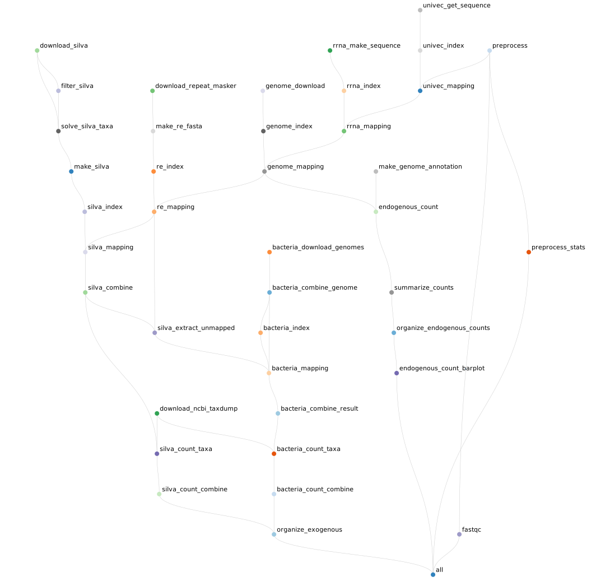

# Human Extracellular small RNA-seq pipeline

[](https://snakemake.bitbucket.io)
[](https://cdn.rawgit.com/zhuchcn/exceRNApipeline/master/.test/report.html)

Data processing pipeline for extracellular small RNA-seq from human specimen. This pipeline is designated for running on HPC with the job management system [SLURM](https://slurm.schedmd.com/sbatch.html). The pipeline has four steps:

1. Preprocess: remove adapters and trimming low quality nucleotides, using [HTStream](https://github.com/ibest/HTStream).
2. UniVec: map to the NCBI's [UniVec](https://www.ncbi.nlm.nih.gov/tools/vecscreen/univec/) database to remove vector origins.
3. RiboRNA: map to the rRNA sequences.
4. Human Genome: map to human genome.
5. Repetitive Elements: map to [RepeatMasker's](http://www.repeatmasker.org/) repetitive elements sequences
6. SILVA: map to [SILVA's](https://www.arb-silva.de/) ribosomal rRNA gene of bacteria, archaea, and fungi.
7. Bacteria: map to all bacteria genomes in ensemble's database

The aligner STAR is used to align reads to database/genome. The pipeline [exceRpt](https://github.com/gersteinlab/exceRpt) was used as reference. The advantage of this pipeline is that it can take the advantage of HPC's full power by submitting jobs in parallel using SLURM.



## Installation

Clone the repository
```bash
git clone https://github.com/zhuchcn/exceRNAseq.git
```

There are two ways to set up your environment, conda and docker. Conda installs all dependencies while with docker, all dependencies were already pre-installed in a docker image. 

### conda

```bash
conda env create -f environment.yml
```

Or run the command through srun (your system administrator(s) will probably be happy if you do it in this way)
```bash
srun -N 1 -n 1 -t 1-0 conda env create -f environment.yml
```

### docker

In theory, no thing needs to be done if you are using docker. The pipeline should pull the image from docker-hub directly, but just in case it doesn't:
```bash
singularity pull docker://zhuchcn/exce-rna-pipeline
```
To be noticed that, the `snakemake` is still required in this way, which can be installed with conda.
```bash
conda install snakemake
```
This is the **recommended** way.

## pipeline configuration

### samples

The pipeline configuration is set up in the `pipeline_config.yml` file. The samples need to be given in key value paires in the samples section. If relative path is given, it must refer to the directory of the `Snakefile`. 

### exogenous mapping

Set the `exogenous_mapping` to false if you only want to map to the human genome.

### scratch

Depends on your HPC, some allow users to use a `/scratch` folder on each node to avoid too much IO. If your HPC does not use `/scratch`, turn the `use_scratch` off by setting it to `false`.

### genomes and annotations

All genome and annotation files can be automatically downloaded by the pipeline, except the complete human ribosomal RNA sequence, U13369. It must be manually download from NCBI's website and put into the `genomes` folder. The path is blow and also can be found in the `pipeline_config.yml`:

https://ncbi.nlm.nih.gov/nuccore/U13369.1?report=fasta

### slurm configuration

Set up the slurm options by modifying the `slurm_config.yml` file. The default slurm options are set in the `__default__` section, which can be overwritten for each rule in its own section. The default value for the `mail-user` is from the environmental variable `$USER_EMAIL`. You can either change it to your own email address, or set it up in bash like:

```bash
export USER_EMAIL=you@email.com
```

## Run pipeline

The pipeline can be ran in a couple of different ways. You can run it with conda environment.

```bash
conda activate exceRNApipeline
./snakemakeslurm run
```

The recommended way to run the pipeline is through [singularity](https://sylabs.io/docs/). Singularity is a container system designated for HPC. With singularity, the pipeline pulls off the docker image with all softwares already installed. The singularity module needs to be loaded first. If you are using a HPC, it should have singularity installed. Please contact your HPC staff if it doesn't. The `snakemake` is the only thing required in this way.

```bash
module load singularity
./snakemakeslurm run --use-singularity
```

If you want to use the `/scratch` directory of the nodes, you need to bind it to singularity. If the `/scratch` directory is not binded, singularity won't be able to use it.
```bash
./snakemakeslurm run --use-singularity --singularity-args "--bind /scratch:/scratch"
```

```bash
conda activate exceRNApipeline
./snakemakeslurm
```

Additional snakemake arguments can be parsed. For example, the following command submits at most 20 jobs in parallel.
```bash
./snakemakeslurm run -j 20
```

Use the flag '-h' to get some help.
```bash
./snakemakeslurm -h
```

## Results

The results of the pipeline are outputted to the `output` folder. Each of the 7 steps described above has its own folder. The per gene count for endogenous genes, tRNAs, and piRNAs, as well as a gene type summary table, the taxa counts mapped to exogenous databases are copied to the `output/results` folder. The bam files mapped to endogenous genome are saved in the `output/04-Genome`, in each sample's directory. The bam files mapping to exogenous databases are not saved.

## clean scratches

If scratch is used, the files in scratch should be removed by the pipeline automatically. However in case that jobs are stopped due to errors or cancelled in the middle, the scratch files will stay in the `/scratch` folder of the node that the job was ran. In this case, use the command below to clean the scratches.

```bash
./snakemakeslurm clean-scratch
```

A `slurm_job_status` folder will be created after jobs are submitted. So basically, if the `slurm_job_status` is not empty, run the command above.

## Generate pipeline report

Snakemake supports pipeline report out of box. To generate the report, use the command below:
```bash
snakemake --report report.html
```

## TODO

- [ ] Add workflow report.
- [ ] Let the pipeline bind the `/scratch` automatically when running with singularity.